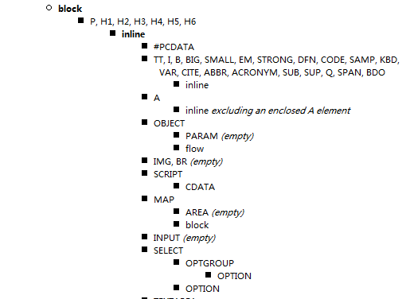
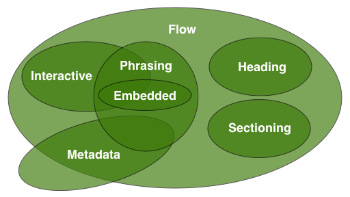
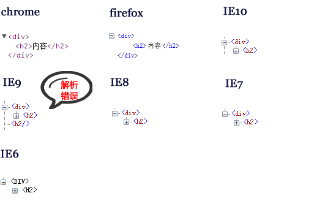
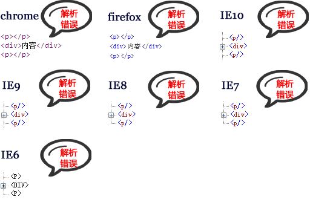
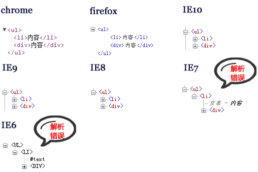
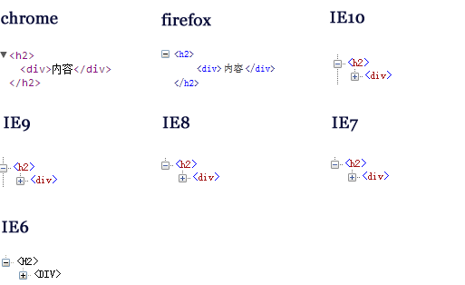
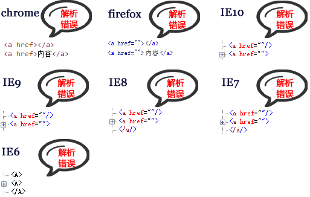

### WEB标准—HTML嵌套

> 注: 本文有些抽象，但是耐心看完，你会有不同的收获 :smile:

先看以下代码:

``` html
<ul>
  <li>
    <h4>
      <a href="xxx">
        <div>
          ccccc
        </div>
      </a>
    </h4>
  </li>
</ul>
```

当然，我是不会告诉你这段代码来自于FACEBOOK的 ，各位认为以上元素的嵌套有没有问题呢？我们会在后面讨论这个。

#### HTML4/XHTML的嵌套规则

在我们的印象中会有这样的嵌套规则:



```
内联元素不能嵌套块元素

<p> 元素 和 <h1>...<h6> 元素不能嵌套块元素
```

详细见  [Allowed nesting of elements in HTML 4 Strict (and XHTML 1.0 Strict)](http://www.cs.tut.fi/~jkorpela/html/strict.html) 。

那么到底什么是块元素，什么是内联元素？

以下是[W3C CSS2.1](http://www.w3.org/TR/CSS21/visuren.html#block-boxes)规范中对块元素和内联元素的定义：

```
Block-level elements are those elements of the source document that are formatted visually as blocks (e.g., paragraphs). The following values of the ‘display’  property make an element block-level: ‘block’, ‘list-item’, and ‘table’.
```

```
Inline-level elements are those elements of the source document that do not form new blocks of content; the content is distributed in lines (e.g., emphasized pieces of text within a paragraph, inline images, etc.). The following values of the ‘display’ property make an element inline-level: ‘inline’, ‘inline-table’, and ‘inline-block’. Inline-level elements generate inline-level boxes, which are boxes that participate in an inline formatting context.
```

我们可以这样理解：块元素一般都从新行开始，内联元素在一行内显示，我们也可以通过CSS属性display的’inline’ 或 ‘ block’ 来改变元素为内联元素或块元素，当然这是CSS中对元素的分类，显然用 ‘display’ 的属性值来对html元素进行分类是不严谨的。


如果按照上述规则来讲，那么FACEBOOK的做法就是一种错误的做法，因为他在内联元素<a>元素中嵌套了块元素元 素<div>，但是细心的读者应该会发现上述规则是基于HTML4/xHTML1的strict模式，而FACEBOOK现在已经统一使用了 html5的doctype，那么这个规则到底还是是否适用？

#### HTML5的元素嵌套规则

元素的嵌套规则和页面头部申明的DTD有着千丝万缕的关系，那么在最新的HTML5规范中是否对元素嵌套有着新的规范呢？

让我们先了解下W3C在最新的HTML5规范中对元素的分类方式：



如上图，元素的分类不再是块元素或内联元素这样来分类（其实从来就没有这样分），而是按照如下分类来分：**Flow**（流式元素）、**Heading**（标题元素）、**Sectioning**（章节元素）、**Phrasing**（段落元素）、**Embedded**（嵌入元素）、**Interactive**（交互元素）、**Metadata**（元数据元素）。

##### Flow(流式元素)

> 在应用程序和文档的主体部分中使用的大部分元素都被分类为**流式元素**。

``` html
a, abbr, address, area(如果它是map的后裔), article, aside, audio, b, bdi, bdo, blockquote, br , button, canvas, cite, code, command, datalist, del, details, dfn, div, dl,em,embed, fieldset, figure, footer, form, h1,h2,h3,h4,h5,h6, header, hgroup, hr, i , iframe, img, input, ins, kbd, keygen, label, map, mark, math, menu, meter, nav ,noscript, object, ol , output, p, pre, progress, q, ruby ,s, samp, script, section, select, small, span, strong, style(如果该元素设置了scoped属性), sub, sup ,svg, table, textarea, time, u, ul , var ,video, wbr, text
```

##### Heading (标题元素)

> **标题式元素**定义一个区块/章节（section）（无论是明确的使用章节式内容的元素标记，或者标题式内容自身所隐含的）的标题。

```
h1, h2, h3, h4, h5, h6, hgroup
```

##### Sectioning(章节元素)

> **章节式元素**是用于定义标题及页脚范围的元素。

```
article, aside, nav, section
```

##### Phrasing(段落元素)

> **段落式元素**是文档中的文本、标记段落级文本的元素。

```
a(如果其只包含段落元素), abbr, area(如果它只是map元素的后裔), audio, b, bdi, bdo, br, button, canvas, cite, code, command, datalist, del(如果其只包含段落样式), dfn, em, embed, i, iframe, img, input, ins(如果其只包含段落式元素), kbd, keygen ,label, map(如果其只包含段落元素), mark, math, meter, noscript, object, output, progress, q, ruby, s, samp, script, select, small, span, strong, sub, sup, svg, textarea, time, u, var, video, wbr, text
```

##### Embedded(嵌入元素)

> **嵌入式元素**是引用或插入到文档中其他资源的元素。

```
audio, canvas, embed, iframe, img, math, object, svg, video
```

##### Interactive(交互元素)

> **交互式元素**是专门用于与用户交互的元素。

```
a, audio(如果设置了controls属性), button, details, embed, iframe, img(如果没设置usemap属性), input(如果type属性不为hidden状态), keygen, label, menu(如果type属性为toolbar状态), object(如果设置了usemap属性), select, textarea, video(如果设置了controls属性)
```

##### Metadata(元数据元素)

> **元数据元素**是可以被用于说明其他内容的表现或行为，或者在当前文档和其他文档之间建立联系的元素

```
base, command, link, meta, noscript, style, title
```

*各分类会有交叉或重叠的现象，这说明在html5中，元素可能属于上述所有分类中的一个或多个。*

---

##### 举个例子1: `<h1>...<h6>`元素：

- Categories:
  - Flow content
  - Heading content
  - Palpable content
- Contexts in which this element can be used:
  - As a child of an hgroup element
  - Where flow content is expected
- Content model:
  - Phrasing content

其中的[Categories] 说明该元素的类别, [Contenxts in which this element can be used] 说明该元素能在任何场景下被使用，也就是它的父元素是什么, [Content model] 说明该元素可以包含内容是什么, 由于页面中的元素是层层嵌套，一个元素可能既是父元素同时也是子元素的角色，所以下面我以 [Content model] 也就是可以包含的子元素做讨论.


**那么对于 h1~h6元素：**

- 它们同时属于**Flow content** 、**Heading content** 和** Palpable content**三个分类
- 它们的父元素可以是<hgroup>，同时那些子元素是流式元素的元素也可以作为h1-h6元素的父元素
- 它们允许的子元素是段落式元素

---

##### 举个例子2: `<div>` 元素

- Categories:
  - Flow content.
  - Palpable content.
- Contexts in which this element can be used:
  - Where phrasing content is expected.
- Content model:
  - Flow content

**对于 `<div>`元素:**

- 同时属于**Flow content** 、**Palpable content**分类
- 父元素必须是那些子元素为段落式元素的元素
- 允许的子元素是流式元素

<div>元素允许的子元素是流式元素，流式元素基本涵括了页面中的大部分元素，所以我们在用<div>时可以不用担心嵌套错误的问题。

但对于<h1>~<h6>元素，它们允许的子元素为段落式元素，而段落式元素并不包含诸 如<div>、<p>、<ul><ol>之类的元素，这就说明按照html5的规范，是不允许在标题元 素内部嵌入<div>、<p>、<ul><ol>之类的元素。

---

##### 举个例子3: <a> 元素

- Categories:
  - Flow content.
  - Phrasing content.
  - Interactive content.
  - Palpable content.
- Contexts in which this element can be used:
  - Where phrasing content is expected.
- Content model:
  - Transparent, but there must be no interactive content descendant.

**对于`<a>`元素:**

- 同时属于**Flow content** 、**Phrasing content、Interactive content、Palpable content**分类
- 父元素必须是那些子元素为段落式元素的元素
- 允许的子元素是以它的父元素允许的子元素为准，但不能包含交互式元素


**这样看<a>元素还是挺有意思的，允许的子元素要看它的父元素所能包含的子元素。**

---


在来看文章开头中提到的代码

```html
<ul>
  <li>
    <h4>
      <a href="xxx">
        <div>
          ccccc
        </div>
      </a>
    </h4>
  </li>
</ul>
```

这时<a>的父元素为<h4>，对于<h1>~<h6>的标题元素上面已经提过，允许的子元素是 段落式元素，那么此时对于<a>允许的子元素即为段落式元素，而段落式元素中是不包含<div>元素的，所以**FCAEBOOK这样的嵌套方法是错误的！**

让我们来把代码做一下修改：

```
<ul>
  <li>
    <div>
      <a href="xxx">
        <div>
          ccccc
        </div>
      </a>
    </div>
  </li>
</ul>
```

这时<a>的父元素为<div>，而<div>元素允许的子元素是流式元素，流式元素中包含<div>元素，所以这样的情形下在<a>里面嵌套<div>就是正确的做法！

---

#### 嵌套错误可能引起的问题

上面讲了HTML5对元素新的分类方式和以<h1>~<h6>、<div>、<a>元素举例讲述 了各自的嵌套规则，但FACEBOOK即使不按照标准去嵌套也不会有大的错误问题，这就给我们带来了一个思考：嵌套错误到底会不会有问题？

###### 举个栗子1：开始与结束标签嵌套错误

```html
<div>
	<h2>
      内容
	</div>
</h2>
```

测试结果:



##### 举个栗子2：`<p>`元素嵌套`<div>`元素

```html
<p>
  <div>
    内容
  </div>
</p>
```

测试结果:



##### 举个栗子3：列表元素`<li>`兄弟元素为`<div>`

```html
<ul>
  <li>内容</li>
  <div>内容</div>
</ul>
```

测试结果:



##### 举个栗子4：`<h2>`元素嵌套`<div>`元素

```html
<h2>
  <div>
    内容
  </div>
</h2>
```

测试结果：



##### 举个栗子5：`<a>`元素嵌套`<a>`元素

``` html
<a href="">
  <a href="">内容</a>
</a>
```

测试结果:



通过上述栗子，我们总结如下：

- 元素开始与结束标签嵌套错误，页面可以在大部分浏览器被正常解析，IE9会出现解析错误
- 在<p>元素内嵌入<div>等元素造成所有浏览器的解析错误
- 在<h1>~<h6>元素内嵌入<div>等元素所有浏览器可以解析正常
- 在<a>元素内嵌入<a>元素会导致所有浏览器的解析错误
- 在列表元素<li><dt><dd>等插入非列表兄弟元素会导致IE6IE7的解析错误

其实，这里说解析错误并不是很合理，应该是说浏览器解析出来的结果和我们期望的结果不一致，但任何的嵌套错误都不会导致页面呈现有很大的出错。

我们知道[JS](http://caibaojian.com/javascript/)代码如果写的有语法错误，浏览器的JS解释器就会拒绝执行并且报错，而浏览器在遇到不符合语法规定的[HTML](http://caibaojian.com/t/html)代码时则会千方百计将其呈现出来。

---

#### 严格嵌套约束、语义嵌套约束

通过上面的示例我们发现在<p>元素里嵌套<div>元素或者<a>元素里<a>元素会导致所有的浏览器都解析错误，这其实是W3C规范的严格嵌套约束，严格嵌套约束要求必须去遵守，不然就会导致所有浏览器的解析错误。

**严格嵌套约束规则：**

- a元素里不可以嵌套交互式元素(<a>、<button>、<select>等)
- <p>里面不可以嵌 套<div>、<h1>~<h6>、<p>、<ul>/<ol> /<li>、<dl>/<dt>/<dd>、<form>等

**语义嵌套约束：**

- 每个元素基本都有自己的嵌套规则（即父元素可以是什么，子元素可以是什么），除了严格嵌套约束之外的一些规则就是语义嵌套约束，对于语义嵌套约束，如果不遵守，页面可能正常，但也可能解析错误，这和下面要讲的容错机制有关。

#### 浏览器的容错机制

- 并不是每位同学在写完页面后去做合法性检查，因此浏览器厂商不得不让它们的浏览器以尽可能宽松的方式去处理网页，每个浏览器内核中都有相当一部分代码专门用来处理那些含糊不清的html标记及嵌套，并且会去猜测前端们到底想如何呈现网页，这是浏览器的**容错机制**。
- 这其实在告诉我们，我们写出来的HTML代码不符合W3C规范可能最终呈现出来没有异样，但那其实是浏览器的一种容错机制，我们没有理由让自己以一个随性的态度去coding，对待自己的代码应该一丝不苟，即使HTML5的胸襟很宽广。

#### 拥抱WEB标准

- 原本我们认为从HTML4到XHTML是一个时代，现在又从XHTML跨到了HTML5，新时代新标准的诞生，我们应该敞开胸怀去拥抱，而不是排斥。

- 你关注或不关注，标准就在那里，只增不减。我们应该感谢W3C这样一个组织，让各个浏览器厂商抛开彼此的敌意共同制定新的标准。不然，也许你会像90年代那样，JS引用一个元素都需要为某个浏览器写一套自己的代码。

- WEB标准只会使我们吃饭变得更香，睡眠变得更好，新的技术或标准会推动我们去富有热情的coding，而不是每天在重复劳动。

  ​

---

from : http://www.smallni.com/element-nesting/